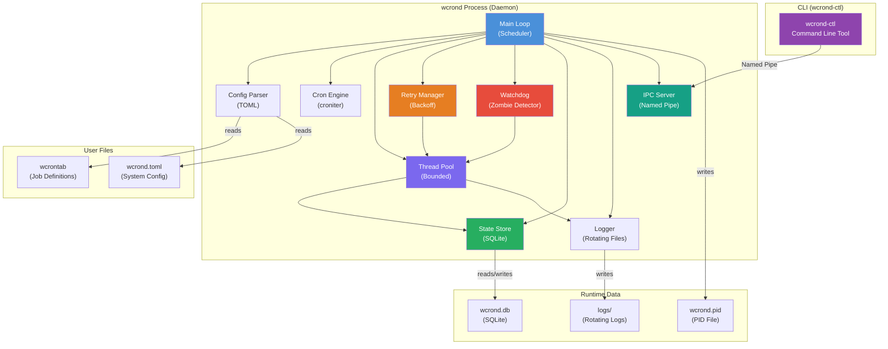
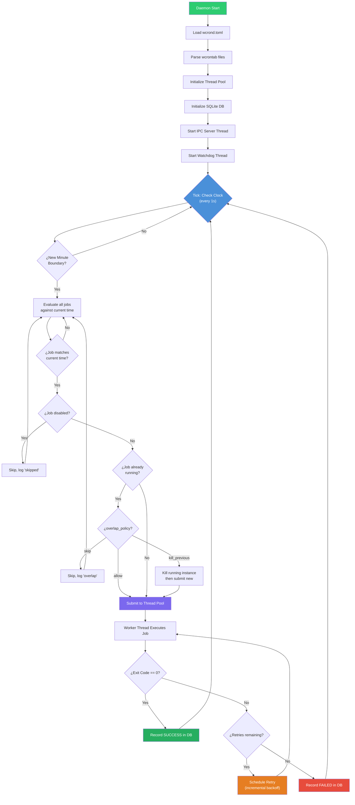
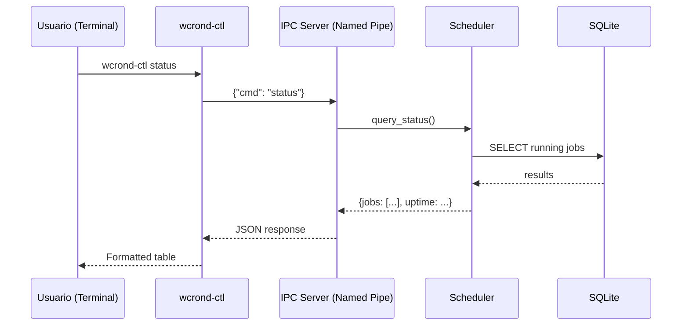
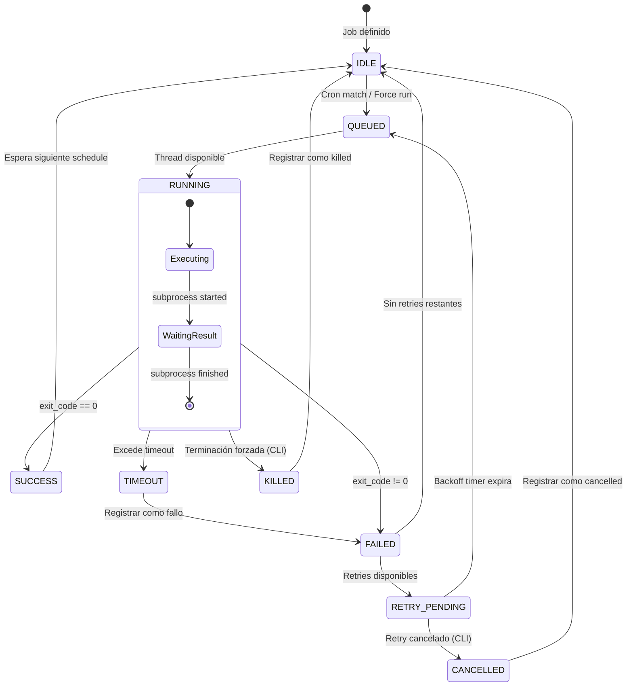

# Arquitectura As-Built

Este documento describe la arquitectura final implementada de **wcrond** (Windows Cron Daemon).

## 1. Stack Tecnológico

- **Lenguaje**: Python 3.10+
- **Cron Parsing**: `croniter`
- **Concurrencia**: `concurrent.futures.ThreadPoolExecutor`
- **Subprocesos**: `subprocess.Popen`
- **IPC**: Named Pipes (Win32) vía `pywin32`
- **Configuración**: TOML (`tomllib` o `tomli`)
- **Estado/Historial**: SQLite 3

## 2. Diagrama de Componentes

## 3. Flujo del Scheduler

El Scheduler es el núcleo de wcrond, ejecutándose en el hilo principal y comprobando las tareas cada segundo.

## 4. Comunicación IPC

wcrond utiliza Named Pipes de Windows para permitir la comunicación bidireccional entre el daemon y la utilidad CLI.

## 5. Estados de Ejecución (Jobs)

El ciclo de vida de un Job está claramente definido e incluye transiciones para timeouts, cancelaciones y reintentos.

## 6. Decisiones de Diseño Clave

1.  **Named Pipes en lugar de Sockets TCP**: Mejora la seguridad (ACLs de Windows nativas) y evita conflictos de red/firewalls.
2.  **ThreadPoolExecutor en lugar de asyncio para subprocesos**: La naturaleza bloqueante del sistema operativo al esperar subprocesos encaja mejor con un modelo de Thread Pool para las ejecuciones concurrentes, manteniendo libre el loop principal del scheduler.
3.  **Configuración TOML**: Moderno, legible y seguro. Con soporte nativo en Python 3.11+.
4.  **SQLite como State Store**: Proporciona almacenamiento robusto, consultable y persistente sin requerir un servidor de base de datos externo.
