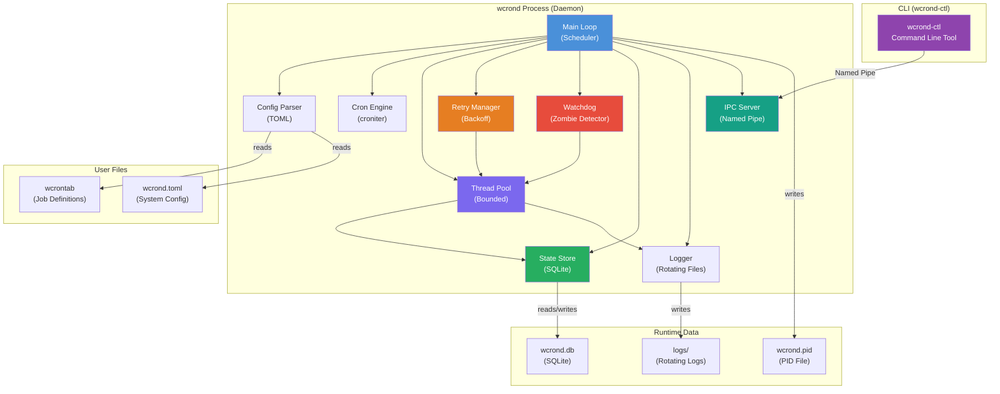
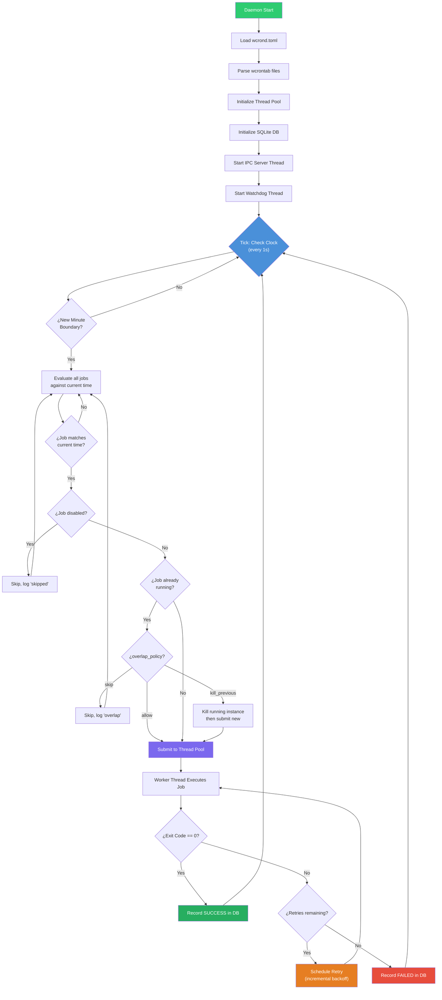
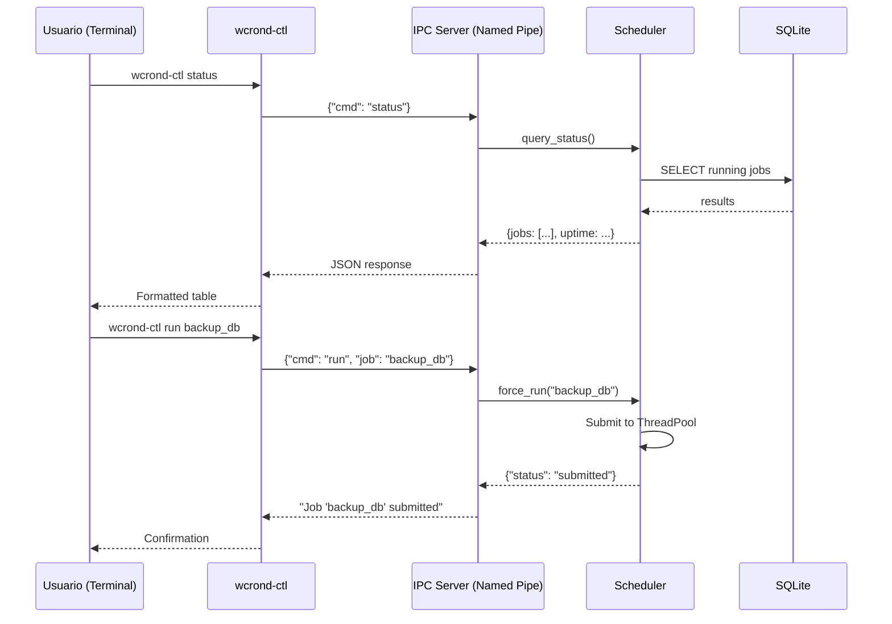
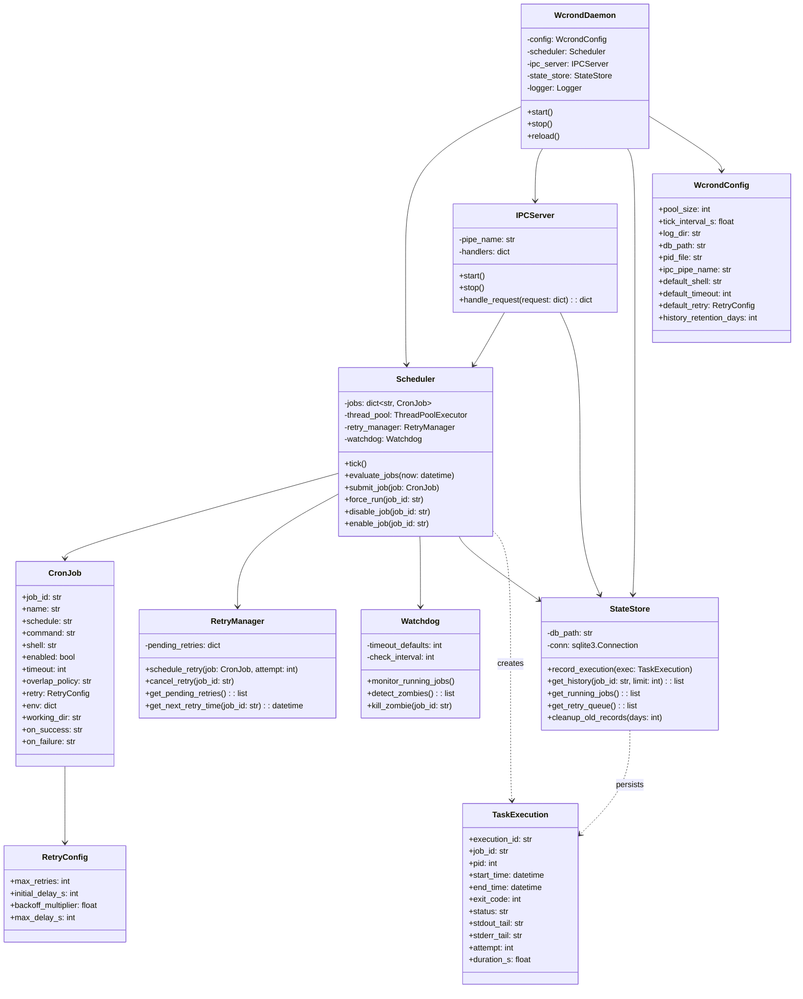
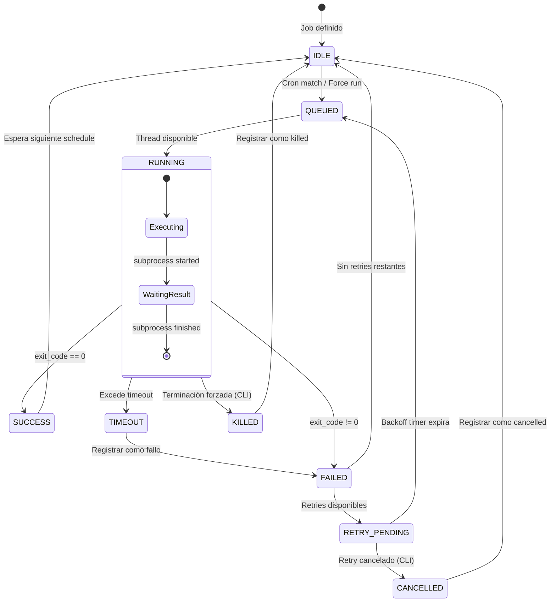

# wcrond — Product Requirements Document (PRD)

> **Versión:** 1.0.0
> **Fecha:** 2026-08-06
> **Autor:** Arquitectura de Software / Systems Engineering
> **Estado:** Borrador para Revisión

---

## 1. Resumen Ejecutivo

**wcrond** (Windows Cron Daemon) es un servicio ligero de planificación de tareas para escritorio Windows que emula el comportamiento de `crond` de Linux. Se ejecuta como un proceso residente (demonio de escritorio) sin depender del Windows Task Scheduler, ofreciendo programación basada en expresiones cron estándar, aislamiento de tareas mediante thread pool acotado, reintentos con backoff incremental, monitoreo detallado y herramientas de control en línea de comandos.

---

## 2. Objetivos y Alcance

### 2.1 Objetivos

| # | Objetivo | Criterio de Éxito |
|---|----------|-------------------|
| O1 | Emular las funcionalidades principales de `crond` de Linux en Windows | Soporte completo de sintaxis crontab de 5 campos, shortcuts (`@daily`, `@hourly`, etc.), variables de entorno por job, y comentarios |
| O2 | Ejecutar como demonio ligero de escritorio | Consumo < 30 MB RAM en idle, < 1% CPU en idle |
| O3 | Garantizar aislamiento y concurrencia segura | Ninguna tarea colgada bloquea la ejecución de las demás; detección y terminación de tareas zombie |
| O4 | Proveer resiliencia mediante reintentos | Backoff incremental configurable por tarea, con límites y cancelación manual |
| O5 | Ofrecer monitoreo y herramientas de control | CLI para listar estado, historial, forzar ejecución, cancelar reintentos, deshabilitar tareas |

### 2.2 Fuera de Alcance

- Integración con Windows Task Scheduler.
- Infraestructura empresarial (Active Directory, GPOs, clustering).
- Ejecución como Windows Service de tipo NT (se ejecuta como proceso de escritorio persistente).
- Interfaz gráfica (GUI) — se provee solo CLI; una GUI futura queda fuera de esta versión.
- Soporte multi-usuario con perfiles separados (single-user en desktop).
- Funcionalidad `anacron` completa (ejecución de tareas perdidas tras apagado). Se incluye solo detección básica.

---

## 3. Arquitectura del Sistema

### 3.1 Propuesta de Tech Stack y Justificación

| Componente                             | Tecnología                                                   | Justificación                                                                                                                                                            |
| -------------------------------------- | ------------------------------------------------------------ | ------------------------------------------------------------------------------------------------------------------------------------------------------------------------ |
| **Lenguaje principal**                 | Python 3.10+                                                 | Ya instalado y configurado en la máquina destino. Amplio ecosistema de bibliotecas estándar. Desarrollo rápido de prototipos y mantenimiento sencillo                    |
| **Parsing de expresiones cron**        | `croniter` (PyPI)                                            | Librería madura, ligera (~50 KB), sin dependencias transitivas pesadas. Soporte completo de sintaxis cron de 5 campos y shortcuts                                        |
| **Concurrencia**                       | `concurrent.futures.ThreadPoolExecutor` (stdlib)             | Thread pool acotado nativo de Python. Ideal para I/O-bound tasks (lanzar subprocesos). No requiere dependencias externas                                                 |
| **Ejecución de comandos**              | `subprocess.Popen` (stdlib)                                  | Control total del ciclo de vida del proceso hijo: stdin/stdout/stderr, timeouts, kill                                                                                    |
| **IPC (CLI ↔ Daemon)**                 | Named Pipes (Win32) vía `win32pipe`/`win32file` de `pywin32` | Mecanismo IPC nativo de Windows. Seguridad integrada con ACLs, sin exposición de puertos de red. `pywin32` ya es una dependencia estándar en entornos Windows con Python |
| **Configuración**                      | TOML (stdlib `tomllib` en 3.11+, `tomli` backport)           | Formato limpio, tipado, ideal para configuración. Nativo en Python 3.11+. Más legible que INI, más simple que YAML                                                       |
| **Almacenamiento de estado/historial** | SQLite 3 (stdlib `sqlite3`)                                  | Base de datos embebida, sin servidor, transaccional. Perfecta para registro de ejecuciones y estado persistente                                                          |
| **Logging**                            | `logging` (stdlib) con `RotatingFileHandler`                 | Logging rotativo nativo, sin dependencias                                                                                                                                |
| **Empaquetado/distribución**           | `pip install .` + script entry point                         | Instalación limpia via pip. Opcional: `PyInstaller` para generar `.exe` standalone                                                                                       |
| **Gestión de dependencias**            | `pyproject.toml` + `pip`                                     | Estándar moderno de empaquetado Python (PEP 621)                                                                                                                         |

**¿Por qué no asyncio?** Aunque `asyncio` sería viable para el scheduler loop, la ejecución real de tareas es *lanzar procesos del sistema operativo* (`subprocess`), que es inherentemente bloqueante en la espera del resultado. Un `ThreadPoolExecutor` permite manejar esto de forma natural: cada thread espera a que su subproceso finalice sin bloquear el scheduler. Además, `ThreadPoolExecutor` es conceptualmente más simple para "N tareas en paralelo con límite", que es exactamente el requerimiento.

**¿Por qué Named Pipes?** Named Pipes en Windows ofrecen:
- Seguridad integrada con ACLs de Windows (no se necesita manejar autenticación).
- Sin exposición de puertos de red (cero riesgo de firewall o conflictos de puerto).
- Mejor rendimiento para IPC local vs sockets TCP.
- `pywin32` es dependencia obligatoria del proyecto, por lo que su disponibilidad está garantizada.

### 3.2 Diagrama de Arquitectura de Alto Nivel



### 3.3 Diagrama de Flujo del Scheduler (Main Loop)



### 3.4 Diagrama de Componentes — Interacción IPC



### 3.5 Diagrama de Clases (Simplificado)



---

## 4. Funcionalidades Detalladas

### 4.1 Parsing de Expresiones Cron (emulación de crond)

#### 4.1.1 Sintaxis Soportada

Formato estándar de 5 campos:

```
# .---------------- minute (0 - 59)
# |  .------------- hour (0 - 23)
# |  |  .---------- day of month (1 - 31)
# |  |  |  .------- month (1 - 12) OR jan,feb,mar,...
# |  |  |  |  .---- day of week (0 - 6) (Sunday=0 or 7) OR sun,mon,...
# |  |  |  |  |
# *  *  *  *  *  command
```

**Operadores soportados:**

| Operador | Ejemplo | Significado |
|----------|---------|-------------|
| `*` | `* * * * *` | Cada unidad de tiempo |
| `,` | `1,15 * * * *` | Lista de valores |
| `-` | `1-5 * * * *` | Rango |
| `/` | `*/15 * * * *` | Intervalo (step) |
| Combinados | `1-30/5 9-17 * * mon-fri` | Cada 5 minutos del minuto 1 al 30, horas 9-17, lunes a viernes |

**Shortcuts soportados:**

| Shortcut | Equivalente | Descripción |
|----------|-------------|-------------|
| `@yearly` / `@annually` | `0 0 1 1 *` | Una vez al año |
| `@monthly` | `0 0 1 * *` | Primer día de cada mes |
| `@weekly` | `0 0 * * 0` | Cada domingo a medianoche |
| `@daily` / `@midnight` | `0 0 * * *` | Cada día a medianoche |
| `@hourly` | `0 * * * *` | Cada hora en punto |
| `@reboot` | N/A | Al iniciar el daemon |

#### 4.1.2 Variables de Entorno por Job

Cada job puede definir variables de entorno que se inyectarán en el subproceso:

```toml
[jobs.mi_tarea.env]
PATH = "C:\\Python310;C:\\Windows\\System32"
MY_VAR = "valor"
```

Estas variables se fusionan con las variables de entorno del sistema (las del job tienen prioridad).

### 4.2 Concurrencia — Thread Pool Acotado

#### 4.2.1 Diseño

- **Implementación:** `concurrent.futures.ThreadPoolExecutor(max_workers=N)`.
- **Tamaño por defecto:** `N = 4` (configurable en `wcrond.toml`).
- **Aislamiento:** Cada tarea se ejecuta como un `subprocess.Popen` en su propio thread. El thread solo espera al subproceso; si el subproceso cuelga, el thread queda ocupado pero **no bloquea al scheduler**.
- **Timeout por tarea:** Cada job tiene un `timeout` configurable (default: 3600 s = 1 hora). Si el subproceso no termina en ese tiempo, se envía `SIGTERM` (vía `process.terminate()`), y tras un grace period de 5 segundos, `SIGKILL` (vía `process.kill()`).
- **Política de overlap:** Configurable por job:
  - `skip`: Si el job ya está corriendo, no se lanza otra instancia (default).
  - `allow`: Se permite ejecución concurrente de múltiples instancias.
  - `kill_previous`: Se mata la instancia anterior y se lanza una nueva.

#### 4.2.2 Diagrama de Estados de un Job en Ejecución



### 4.3 Watchdog — Detección de Tareas Zombie

El **Watchdog** es un thread dedicado que monitorea las tareas en ejecución:

- **Intervalo de chequeo:** Cada 30 segundos (configurable).
- **Criterio de zombie:** Una tarea que ha excedido su `timeout` y cuyo proceso aún está vivo.
- **Acción:**
  1. Registrar en log como `ZOMBIE_DETECTED`.
  2. Enviar `terminate()` al proceso.
  3. Esperar `grace_period` (5s).
  4. Si sigue vivo: `kill()` forzado.
  5. Registrar estado final como `TIMEOUT` en la base de datos.
- **Identificación:** El CLI puede listar tareas zombie actuales con `wcrond-ctl zombies`.

### 4.4 Resiliencia — Reintentos con Backoff Incremental

#### 4.4.1 Mecanismo

Cuando una tarea falla (exit code ≠ 0), el **RetryManager** evalúa si hay reintentos disponibles:

```
delay = min(initial_delay_s * (backoff_multiplier ^ attempt), max_delay_s)
```

**Ejemplo con valores por defecto:**

| Intento | Delay | Tiempo acumulado |
|---------|-------|------------------|
| 1 | 30s | 0:30 |
| 2 | 60s | 1:30 |
| 3 | 120s | 3:30 |
| 4 | 240s | 7:30 |
| 5 | 300s (max) | 12:30 |

#### 4.4.2 Configuración por Job

```toml
[jobs.mi_tarea.retry]
max_retries = 5          # Máximo número de reintentos (default: 3)
initial_delay_s = 30     # Delay inicial en segundos (default: 30)
backoff_multiplier = 2.0 # Multiplicador de backoff (default: 2.0)
max_delay_s = 300        # Delay máximo en segundos (default: 300)
```

#### 4.4.3 Cancelación de Reintentos

- **Via CLI:** `wcrond-ctl cancel-retry <job_id>` cancela todos los reintentos pendientes para un job.
- **Automática:** Si el job se deshabilita (`wcrond-ctl disable <job_id>`), los reintentos pendientes también se cancelan.

### 4.5 Monitoreo

#### 4.5.1 Base de Datos de Estado (SQLite)

**Tabla `executions`:**

| Columna | Tipo | Descripción |
|---------|------|-------------|
| `execution_id` | TEXT PK | UUID de la ejecución |
| `job_id` | TEXT | Identificador del job |
| `job_name` | TEXT | Nombre legible del job |
| `start_time` | TEXT (ISO8601) | Timestamp de inicio |
| `end_time` | TEXT (ISO8601) | Timestamp de fin |
| `duration_s` | REAL | Duración en segundos |
| `exit_code` | INTEGER | Código de salida |
| `status` | TEXT | `SUCCESS`, `FAILED`, `TIMEOUT`, `KILLED`, `RUNNING` |
| `attempt` | INTEGER | Número de intento (1 = primera ejecución) |
| `pid` | INTEGER | PID del subproceso |
| `stdout_tail` | TEXT | Últimas 100 líneas de stdout |
| `stderr_tail` | TEXT | Últimas 100 líneas de stderr |
| `trigger` | TEXT | `scheduled`, `manual`, `retry` |

**Tabla `retry_queue`:**

| Columna | Tipo | Descripción |
|---------|------|-------------|
| `job_id` | TEXT PK | Job con retry pendiente |
| `attempt` | INTEGER | Número de intento siguiente |
| `next_retry_at` | TEXT (ISO8601) | Cuándo se ejecutará el reintento |
| `reason` | TEXT | Motivo del fallo original |

**Retención:** Los registros se purgan automáticamente tras `history_retention_days` (default: 30 días).

#### 4.5.2 Salida del CLI de Monitoreo

```
> wcrond-ctl history --last 5

┌──────────┬─────────────────────┬─────────────────────┬──────────┬─────────┬─────────┬─────────┐
│ Job      │ Started             │ Ended               │ Duration │ Status  │ Attempt │ Trigger │
├──────────┼─────────────────────┼─────────────────────┼──────────┼─────────┼─────────┼─────────┤
│ backup   │ 2026-08-06 01:00:01 │ 2026-08-06 01:05:32 │ 5m 31s   │ SUCCESS │ 1       │ sched   │
│ cleanup  │ 2026-08-06 02:00:00 │ 2026-08-06 02:00:04 │ 4.1s     │ SUCCESS │ 1       │ sched   │
│ sync_db  │ 2026-08-06 03:00:01 │ 2026-08-06 03:00:45 │ 44.2s    │ FAILED  │ 1       │ sched   │
│ sync_db  │ 2026-08-06 03:00:31 │ 2026-08-06 03:01:10 │ 39.8s    │ FAILED  │ 2       │ retry   │
│ sync_db  │ 2026-08-06 03:02:31 │ 2026-08-06 03:03:05 │ 34.1s    │ SUCCESS │ 3       │ retry   │
└──────────┴─────────────────────┴─────────────────────┴──────────┴─────────┴─────────┴─────────┘

> wcrond-ctl retries

┌──────────┬─────────┬─────────────────────┬──────────────────────────────┐
│ Job      │ Attempt │ Next Retry At       │ Reason                       │
├──────────┼─────────┼─────────────────────┼──────────────────────────────┤
│ send_rpt │ 3       │ 2026-08-06 04:12:00 │ exit code 1: connection err  │
└──────────┴─────────┴─────────────────────┴──────────────────────────────┘
```

### 4.6 Herramientas de Control (CLI — `wcrond-ctl`)

| Comando                                                       | Descripción                                                                        |
| ------------------------------------------------------------- | ---------------------------------------------------------------------------------- |
| `wcrond-ctl --help`                                           | Muestra una breve ayuda con la lista de todos los comandos disponibles             |
| `wcrond-ctl status`                                           | Estado general del daemon: uptime, jobs cargados, threads activos, cola de retries |
| `wcrond-ctl list`                                             | Lista todos los jobs con su schedule, estado (enabled/disabled), última ejecución  |
| `wcrond-ctl history [--job <id>] [--last N] [--since <date>]` | Historial de ejecuciones con filtros                                               |
| `wcrond-ctl retries`                                          | Lista de reintentos pendientes: job, intento, siguiente ejecución, motivo          |
| `wcrond-ctl run <job_id>`                                     | Forzar ejecución inmediata de un job (ignora schedule y estado disabled)           |
| `wcrond-ctl kill <job_id>`                                    | Forzar terminación de la instancia en ejecución de un job                          |
| `wcrond-ctl cancel-retry <job_id>`                            | Cancelar reintentos pendientes de un job                                           |
| `wcrond-ctl disable <job_id>`                                 | Deshabilitar un job (no se ejecutará en schedule; cancela retries)                 |
| `wcrond-ctl enable <job_id>`                                  | Habilitar un job previamente deshabilitado                                         |
| `wcrond-ctl zombies`                                          | Listar tareas zombie activas (excedieron timeout, proceso aún vivo)                |
| `wcrond-ctl reload`                                           | Recargar archivos de configuración y wcrontab sin reiniciar el daemon              |
| `wcrond-ctl logs [--job <id>] [--tail N]`                     | Ver logs recientes, opcionalmente filtrados por job                                |
| `wcrond-ctl validate`                                         | Validar archivos de configuración y wcrontab sin ejecutar                          |
| `wcrond-ctl next [--job <id>]`                                | Mostrar las próximas N ejecuciones programadas                                     |

---

## 5. Estructura de Directorios

### 5.1 Código Fuente (Repositorio)

```
wcron/
├── pyproject.toml                 # Configuración del proyecto Python (PEP 621)
├── README.md                      # Documentación del proyecto
├── LICENSE                        # Licencia del proyecto
├── wcrond_prd.md                  # Este documento
│
├── src/
│   └── wcrond/
│       ├── __init__.py            # Versión y metadata del paquete
│       ├── __main__.py            # Entry point: python -m wcrond
│       │
│       ├── daemon.py              # WcrondDaemon: orquestador principal
│       ├── scheduler.py           # Scheduler: main loop, evaluación de jobs
│       ├── job.py                 # CronJob: modelo de datos de un job
│       ├── parser.py              # Parser de archivos wcrontab (TOML)
│       ├── executor.py            # Ejecución de jobs en threads (subprocess)
│       ├── retry.py               # RetryManager: backoff incremental
│       ├── watchdog.py            # Watchdog: detección de zombies
│       ├── state.py               # StateStore: SQLite wrapper
│       ├── ipc.py                 # IPCServer: Named Pipe server
│       ├── config.py              # WcrondConfig: carga de wcrond.toml
│       └── logging_config.py      # Configuración del sistema de logging
│
├── src/
│   └── wcrond_ctl/
│       ├── __init__.py
│       ├── __main__.py            # Entry point: python -m wcrond_ctl
│       ├── cli.py                 # CLI con argparse: parsing de comandos
│       ├── client.py              # IPC client: comunicación con el daemon
│       └── formatters.py          # Formateo de salida (tablas, colores)
│
├── tests/
│   ├── __init__.py
│   ├── test_parser.py             # Tests del parser de wcrontab
│   ├── test_scheduler.py          # Tests del scheduler
│   ├── test_executor.py           # Tests del executor
│   ├── test_retry.py              # Tests del retry manager
│   ├── test_watchdog.py           # Tests del watchdog
│   ├── test_state.py              # Tests del state store
│   ├── test_ipc.py                # Tests de IPC
│   ├── test_config.py             # Tests de configuración
│   └── test_integration.py        # Tests de integración end-to-end
│
├── examples/
│   ├── wcrond.toml                # Ejemplo de configuración del sistema
│   └── wcrontab.toml              # Ejemplo de definición de jobs
│
└── scripts/
    ├── install.ps1                # Script de instalación PowerShell
    └── uninstall.ps1              # Script de desinstalación PowerShell
```

### 5.2 Estructura de Despliegue (Runtime en Disco)

```
%USERPROFILE%/
└── .wcrond/                           # Directorio raíz de configuración y datos
    ├── wcrond.toml                    # Configuración del sistema
    ├── wcrontab.toml                  # Definición de jobs (archivo principal)
    ├── jobs.d/                        # Directorio para jobs adicionales (equivale a /etc/cron.d/)
    │   ├── backups.toml               #   Jobs de backup
    │   └── maintenance.toml           #   Jobs de mantenimiento
    ├── data/
    │   ├── wcrond.db                  # Base de datos SQLite (historial + estado)
    │   └── wcrond.pid                 # PID file del daemon
    └── logs/
        ├── wcrond.log                 # Log principal (rotativo)
        ├── wcrond.log.1               # Log rotado
        ├── wcrond.log.2               # Log rotado
        └── jobs/                      # Logs individuales por job (stdout/stderr)
            ├── backup_db/
            │   ├── 2026-08-06_010001.stdout.log
            │   └── 2026-08-06_010001.stderr.log
            └── sync_files/
                ├── 2026-08-06_030001.stdout.log
                └── 2026-08-06_030001.stderr.log
```

---

## 6. Archivos de Configuración — Diseño y Ejemplos

### 6.1 Configuración del Sistema — `wcrond.toml`

```toml
# =============================================================================
# wcrond.toml — Configuración del sistema wcrond
# =============================================================================
# Ubicación por defecto: %USERPROFILE%/.wcrond/wcrond.toml
# Puede sobreescribirse con: wcrond --config <path>

[daemon]
# Intervalo del tick del scheduler en segundos.
# El daemon verifica tareas pendientes en cada tick.
tick_interval = 1.0

# Archivo PID para detectar instancias duplicadas.
pid_file = "data/wcrond.pid"              # Relativo a ~/.wcrond/

# Shell por defecto para ejecutar comandos.
# Soporta: "cmd", "powershell", "pwsh", "bash", o ruta absoluta.
default_shell = "powershell"

# Directorio de trabajo por defecto para los jobs.
default_working_dir = "%USERPROFILE%"

[pool]
# Número máximo de threads para ejecución concurrente de tareas.
# Recomendación: 2x número de cores para I/O-bound, o 1x para CPU-bound.
max_workers = 4

# Tiempo máximo de ejecución por defecto para un job (en segundos).
# Jobs individuales pueden sobreescribir este valor.
default_timeout = 3600

# Período de gracia tras enviar terminate() antes de kill() (en segundos).
grace_period = 16

[retry]
# Valores por defecto para reintentos. Cada job puede sobreescribirlos.
max_retries = 3
initial_delay_s = 30
backoff_multiplier = 2.0
max_delay_s = 300

[logging]
# Directorio de logs (relativo a ~/.wcrond/).
log_dir = "logs"

# Nivel de logging: DEBUG, INFO, WARNING, ERROR, CRITICAL.
level = "INFO"

# Tamaño máximo del archivo de log antes de rotar (en bytes).
max_bytes = 10_485_760        # 10 MB

# Número de archivos de log rotados a conservar.
backup_count = 5

# Si es true, también se captura stdout/stderr de cada job en archivos individuales.
capture_job_output = true

# Número máximo de líneas de stdout/stderr a almacenar en la DB por ejecución.
output_tail_lines = 100

[database]
# Ruta a la base de datos SQLite (relativa a ~/.wcrond/).
path = "data/wcrond.db"

# Días de retención del historial de ejecuciones. Registros más viejos se purgan.
history_retention_days = 30

# Intervalo de purga automática (en horas).
cleanup_interval_hours = 24

[ipc]
# Nombre del Named Pipe para comunicación CLI <-> Daemon.
pipe_name = "\\\\.\\pipe\\wcrond"

# Timeout de conexión para el CLI en segundos.
client_timeout = 5

[watchdog]
# Intervalo entre chequeos del watchdog (en segundos).
check_interval = 30

# Si es true, se termina automáticamente las tareas zombie.
auto_kill_zombies = true
```

### 6.2 Definición de Jobs — `wcrontab.toml`

```toml
# =============================================================================
# wcrontab.toml — Definición de Jobs Programados
# =============================================================================
# Ubicación por defecto: %USERPROFILE%/.wcrond/wcrontab.toml
# Jobs adicionales pueden colocarse en: %USERPROFILE%/.wcrond/jobs.d/*.toml
#
# Sintaxis cron de 5 campos:
#   .---------------- minute (0 - 59)
#   |  .------------- hour (0 - 23)
#   |  |  .---------- day of month (1 - 31)
#   |  |  |  .------- month (1 - 12) OR jan,feb,mar,...
#   |  |  |  |  .---- day of week (0 - 6) (Sunday=0 or 7) OR sun,mon,...
#   |  |  |  |  |
#   *  *  *  *  *
#
# Shortcuts soportados: @yearly, @monthly, @weekly, @daily, @hourly, @reboot

# -----------------------------------------------------------------------------
# Job: Backup de base de datos — Todos los días a la 1:01 AM
# -----------------------------------------------------------------------------
[jobs.backup_db]
schedule = "01 01 * * *"
command = "C:\\scripts\\backup_database.ps1"
shell = "powershell"                     # Sobreescribe el shell por defecto
working_dir = "C:\\backups"
timeout = 1800                           # 30 minutos max
overlap_policy = "skip"                  # No ejecutar si ya está corriendo
enabled = true

[jobs.backup_db.retry]
max_retries = 5
initial_delay_s = 60
backoff_multiplier = 2.0
max_delay_s = 600

[jobs.backup_db.env]
BACKUP_DEST = "D:\\backups\\db"
LOG_LEVEL = "verbose"

# -----------------------------------------------------------------------------
# Job: Limpieza de archivos temporales — Cada domingo a las 3:00 AM
# -----------------------------------------------------------------------------
[jobs.cleanup_temp]
schedule = "0 3 * * 0"
command = 'Remove-Item -Path "$env:TEMP\\*" -Recurse -Force -ErrorAction SilentlyContinue'
shell = "powershell"
timeout = 600
overlap_policy = "skip"
enabled = true

# Sin reintentos para este job (usa defaults si se omite, o se desactiva así):
[jobs.cleanup_temp.retry]
max_retries = 0

# -----------------------------------------------------------------------------
# Job: Sincronización de archivos — Cada 15 minutos durante horario laboral
# -----------------------------------------------------------------------------
[jobs.sync_files]
schedule = "*/15 08-18 * * mon-fri"
command = "robocopy C:\\Projects D:\\Sync\\Projects /MIR /R:2 /W:5"
shell = "cmd"
timeout = 300
overlap_policy = "skip"
enabled = true

# Usa defaults de retry (heredados de wcrond.toml)

# -----------------------------------------------------------------------------
# Job: Reporte mensual — Primer día de cada mes a las 6:00 AM
# -----------------------------------------------------------------------------
[jobs.monthly_report]
schedule = "@monthly"
command = "python C:\\scripts\\generate_report.py --month previous"
shell = "cmd"
timeout = 7200
overlap_policy = "allow"                 # Permitir overlap (ejecución lenta)
enabled = true

[jobs.monthly_report.retry]
max_retries = 3
initial_delay_s = 120
backoff_multiplier = 3.0
max_delay_s = 900

[jobs.monthly_report.env]
REPORT_OUTPUT = "C:\\Reports"
SMTP_SERVER = "smtp.company.com"

# -----------------------------------------------------------------------------
# Job: Health check — Cada 5 minutos, siempre
# -----------------------------------------------------------------------------
[jobs.health_check]
schedule = "*/5 * * * *"
command = "python -c \"import urllib.request; urllib.request.urlopen('http://localhost:8080/health')\""
shell = "cmd"
timeout = 30
overlap_policy = "skip"
enabled = true

[jobs.health_check.retry]
max_retries = 2
initial_delay_s = 10
backoff_multiplier = 1.5
max_delay_s = 30

# -----------------------------------------------------------------------------
# Job: Ejecución al inicio del daemon — Script de inicialización
# -----------------------------------------------------------------------------
[jobs.startup_init]
schedule = "@reboot"
command = "C:\\scripts\\on_startup.bat"
shell = "cmd"
timeout = 120
overlap_policy = "skip"
enabled = true

[jobs.startup_init.retry]
max_retries = 1
initial_delay_s = 10
backoff_multiplier = 1.0
max_delay_s = 10

# -----------------------------------------------------------------------------
# Job: Reporte trimestral — Día 1 de ene, abr, jul, oct a las 3:02 AM
# -----------------------------------------------------------------------------
[jobs.quarterly_report]
schedule = "02 03 1 1,4,7,10 *"
command = "python C:\\scripts\\quarterly_report.py"
shell = "cmd"
timeout = 3600
overlap_policy = "skip"
enabled = true

# -----------------------------------------------------------------------------
# Job: Recordatorio horario — Entre 9 AM y 5 PM, lunes a viernes
# -----------------------------------------------------------------------------
[jobs.hourly_reminder]
schedule = "01 09-17 * * 1-5"
command = 'powershell -Command "Add-Type -AssemblyName System.Windows.Forms; [System.Windows.Forms.MessageBox]::Show(\"Toma un descanso!\", \"Reminder\")"'
shell = "cmd"
timeout = 10
overlap_policy = "skip"
enabled = false                          # Deshabilitado por defecto
```

### 6.3 Jobs Adicionales — `jobs.d/backups.toml`

```toml
# =============================================================================
# jobs.d/backups.toml — Jobs de backup adicionales
# =============================================================================
# Equivalente al directorio /etc/cron.d/ de Linux.
# Todos los archivos .toml en jobs.d/ se cargan automáticamente.

[jobs.backup_photos]
schedule = "0 2 * * 6"                   # Sábados a las 2 AM
command = "robocopy C:\\Users\\Photos E:\\Backup\\Photos /MIR"
shell = "cmd"
timeout = 7200
overlap_policy = "skip"
enabled = true

[jobs.backup_photos.retry]
max_retries = 3
initial_delay_s = 300
backoff_multiplier = 2.0
max_delay_s = 1800
```

---

## 7. Estrategia de Despliegue e Instalación

### 7.1 Método 1: Instalación via pip (Recomendado)

```powershell
# 1. Clonar o descargar el repositorio
git clone <repository-url> C:\Users\as116758\dev\wcron
cd C:\Users\as116758\dev\wcron

# 2. Instalar el paquete en modo editable (desarrollo) o normal
pip install -e .        # Modo desarrollo
# pip install .         # Modo producción

# 3. Inicializar la configuración
wcrond init
# Crea ~/.wcrond/ con archivos de configuración por defecto

# 4. Editar la configuración y jobs
notepad %USERPROFILE%\.wcrond\wcrond.toml
notepad %USERPROFILE%\.wcrond\wcrontab.toml

# 5. Validar la configuración
wcrond-ctl validate

# 6. Iniciar el daemon
wcrond start
# O en foreground para debug:
wcrond start --foreground
```

### 7.2 Método 2: Ejecutable Standalone (PyInstaller)

```powershell
# Generar ejecutables standalone
pip install pyinstaller
pyinstaller --onefile --name wcrond src/wcrond/__main__.py
pyinstaller --onefile --name wcrond-ctl src/wcrond_ctl/__main__.py

# Los ejecutables se generan en dist/
# Copiar a un directorio en PATH:
copy dist\wcrond.exe C:\tools\
copy dist\wcrond-ctl.exe C:\tools\
```

### 7.3 Inicio Automático con Windows

Para que `wcrond` se inicie automáticamente al hacer login (sin Windows Task Scheduler):

**Opción A: Carpeta Startup del usuario**

```powershell
# Crear shortcut en la carpeta Startup
$WshShell = New-Object -ComObject WScript.Shell
$Shortcut = $WshShell.CreateShortcut(
    "$env:APPDATA\Microsoft\Windows\Start Menu\Programs\Startup\wcrond.lnk"
)
$Shortcut.TargetPath = (Get-Command wcrond).Source
$Shortcut.Arguments = "start"
$Shortcut.WindowStyle = 7  # Minimized
$Shortcut.Save()
```

**Opción B: Registro de Windows (Run key)**

```powershell
# Agregar al registro para auto-start
$wcrondPath = (Get-Command wcrond).Source
New-ItemProperty -Path "HKCU:\Software\Microsoft\Windows\CurrentVersion\Run" `
    -Name "wcrond" `
    -Value "`"$wcrondPath`" start" `
    -PropertyType String -Force
```

**Opción C: Script de instalación automatizado (`scripts/install.ps1`)**

```powershell
# scripts/install.ps1
# Automatiza: crear directorio, copiar configs, registrar auto-start

param(
    [ValidateSet("startup", "registry")]
    [string]$AutoStartMethod = "registry"
)

$wcrondHome = "$env:USERPROFILE\.wcrond"

# Crear estructura de directorios
New-Item -ItemType Directory -Force -Path @(
    $wcrondHome,
    "$wcrondHome\jobs.d",
    "$wcrondHome\data",
    "$wcrondHome\logs",
    "$wcrondHome\logs\jobs"
)

# Copiar archivos de ejemplo si no existen
$examplesDir = Join-Path $PSScriptRoot "..\examples"
if (-not (Test-Path "$wcrondHome\wcrond.toml")) {
    Copy-Item "$examplesDir\wcrond.toml" "$wcrondHome\wcrond.toml"
}
if (-not (Test-Path "$wcrondHome\wcrontab.toml")) {
    Copy-Item "$examplesDir\wcrontab.toml" "$wcrondHome\wcrontab.toml"
}

# Registrar auto-start
$wcrondExe = (Get-Command wcrond -ErrorAction SilentlyContinue).Source
if (-not $wcrondExe) {
    $wcrondExe = "python -m wcrond"
}

switch ($AutoStartMethod) {
    "registry" {
        New-ItemProperty -Path "HKCU:\Software\Microsoft\Windows\CurrentVersion\Run" `
            -Name "wcrond" -Value "`"$wcrondExe`" start" `
            -PropertyType String -Force
        Write-Host "[OK] wcrond registrado en HKCU\Run para auto-start."
    }
    "startup" {
        $WshShell = New-Object -ComObject WScript.Shell
        $lnk = "$env:APPDATA\Microsoft\Windows\Start Menu\Programs\Startup\wcrond.lnk"
        $Shortcut = $WshShell.CreateShortcut($lnk)
        $Shortcut.TargetPath = $wcrondExe
        $Shortcut.Arguments = "start"
        $Shortcut.WindowStyle = 7
        $Shortcut.Save()
        Write-Host "[OK] Shortcut creado en carpeta Startup."
    }
}

Write-Host ""
Write-Host "Instalación completada."
Write-Host "  Config: $wcrondHome\wcrond.toml"
Write-Host "  Jobs:   $wcrondHome\wcrontab.toml"
Write-Host ""
Write-Host "Siguiente paso: editar wcrontab.toml y ejecutar 'wcrond start'"
```

### 7.4 Desinstalación (`scripts/uninstall.ps1`)

```powershell
# scripts/uninstall.ps1

# Detener daemon si está corriendo
try { wcrond-ctl stop } catch {}

# Remover auto-start (ambos métodos)
Remove-ItemProperty -Path "HKCU:\Software\Microsoft\Windows\CurrentVersion\Run" `
    -Name "wcrond" -ErrorAction SilentlyContinue

$lnk = "$env:APPDATA\Microsoft\Windows\Start Menu\Programs\Startup\wcrond.lnk"
if (Test-Path $lnk) { Remove-Item $lnk }

Write-Host "[OK] wcrond desregistrado del auto-start."
Write-Host ""
Write-Host "Los datos en ~/.wcrond/ NO se han eliminado."
Write-Host "Para eliminarlos manualmente: Remove-Item -Recurse ~\.wcrond"
```

---

## 8. `pyproject.toml` — Definición del Paquete

```toml
[build-system]
requires = ["setuptools>=68.0", "wheel"]
build-backend = "setuptools.backends._legacy:_Backend"

[project]
name = "wcrond"
version = "1.0.0"
description = "A lightweight cron daemon for Windows desktop, inspired by Linux crond"
readme = "README.md"
license = {text = "MIT"}
requires-python = ">=3.10"
authors = [
    {name = "Ariel D Salazar H", email = "dayler.salazar@icloud.com"}
]
keywords = ["cron", "scheduler", "windows", "daemon", "task"]
classifiers = [
    "Development Status :: 4 - Beta",
    "Environment :: Win32 (MS Windows)",
    "Intended Audience :: Developers",
    "Intended Audience :: System Administrators",
    "Operating System :: Microsoft :: Windows",
    "Programming Language :: Python :: 3",
    "Topic :: System :: Systems Administration",
]

dependencies = [
    "croniter>=2.0",
    "pywin32>=306",
    "tomli>=2.0; python_version < '3.11'",
]

[project.optional-dependencies]
dev = [
    "pytest>=7.0",
    "pytest-cov>=4.0",
    "pyinstaller>=6.0",
]

[project.scripts]
wcrond = "wcrond.__main__:main"
wcrond-ctl = "wcrond_ctl.__main__:main"

[tool.setuptools.packages.find]
where = ["src"]

[tool.pytest.ini_options]
testpaths = ["tests"]
```

---

## 9. Comparativa: crond (Linux) vs wcrond (Windows)

| Característica | crond (Linux) | wcrond (Windows) | Notas |
|---|---|---|---|
| Sintaxis cron 5 campos | ✅ | ✅ | Idéntica |
| Shortcuts (`@daily`, etc.) | ✅ | ✅ | Idéntico |
| `@reboot` | ✅ | ✅ | Se ejecuta al iniciar el daemon |
| Campo `user` en crontab | ✅ | ❌ | No aplica en desktop single-user |
| `/etc/cron.d/` (drop-in jobs) | ✅ | ✅ | `~/.wcrond/jobs.d/*.toml` |
| `crontab -e` (edición interactiva) | ✅ | ⚠️ | Se edita el TOML directamente + `wcrond-ctl reload` |
| `MAILTO` (envío de resultados) | ✅ | ❌ | Reemplazado por logging a DB + archivos. Extensible en futuro |
| Variables de entorno (`SHELL`, `PATH`) | ✅ | ✅ | Soportado por job en TOML |
| `cron.allow` / `cron.deny` | ✅ | ❌ | No aplica: single-user desktop |
| `anacron` (ejecución de tareas perdidas) | ✅ | ⚠️ Parcial | Detección básica vía timestamps; no reimplementación completa |
| **Retries con backoff** | ❌ | ✅ | **Mejora** sobre crond |
| **Watchdog / detección zombie** | ❌ | ✅ | **Mejora** sobre crond |
| **Historial persistente (SQLite)** | ❌ | ✅ | **Mejora** sobre crond |
| **CLI de control en caliente** | ❌ (solo `crontab`) | ✅ | **Mejora**: run, kill, disable, etc. |
| **Overlap policy** | ❌ | ✅ | **Mejora**: skip, allow, kill_previous |

---

## 10. Seguridad y Consideraciones

### 10.1 Aislamiento de Procesos

- Cada tarea se ejecuta como un **subproceso independiente** (`subprocess.Popen`) con su propio PID.
- Los subprocesos heredan los permisos del usuario que ejecuta `wcrond`.
- Los subprocesos se ejecutan con `CREATE_NEW_PROCESS_GROUP` en Windows, permitiendo enviar señales de terminación sin afectar al daemon.

### 10.2 Seguridad del IPC

- El Named Pipe utiliza la ACL por defecto de Windows, que restringe el acceso al usuario propietario.
- No se expone ningún puerto de red. El Named Pipe es accesible solo localmente y protegido por ACLs del usuario.

### 10.3 PID File

- El daemon escribe su PID en `data/wcrond.pid` al iniciar.
- Al arrancar, verifica si ya existe otro proceso con ese PID: previene instancias duplicadas.
- Al detenerse, elimina el PID file.

### 10.4 Graceful Shutdown

- El daemon captura las señales `SIGINT` (Ctrl+C) y `SIGTERM`.
- Al recibir una señal de parada:
  1. Deja de aceptar nuevos jobs.
  2. Espera a que los jobs en ejecución finalicen (con timeout de `grace_period`).
  3. Cancela reintentos pendientes.
  4. Cierra el IPC server.
  5. Cierra la conexión SQLite.
  6. Elimina el PID file.

---

## 11. Testing y Calidad

### 11.1 Estrategia de Testing

| Nivel | Herramienta | Cobertura |
|-------|-------------|-----------|
| **Unit Tests** | `pytest` | Parser TOML, evaluación de expresiones cron, lógica de retry/backoff, formatters CLI |
| **Integration Tests** | `pytest` | Scheduler + Executor + StateStore: ciclo completo de ejecución, timeout, retry |
| **IPC Tests** | `pytest` | Comunicación CLI ↔ Daemon via Named Pipe: envío de comandos, respuestas |
| **Smoke Tests** | Script PowerShell | Instalación limpia, inicio del daemon, ejecución de job simple, detención |

### 11.2 Métricas de Calidad

| Métrica | Objetivo |
|---------|----------|
| Cobertura de tests | ≥ 80% |
| Memoria en idle | < 30 MB |
| CPU en idle | < 1% |
| Latencia de despacho (cron match → subprocess start) | < 2 segundos |
| Tiempo de respuesta IPC | < 100 ms |

---

## 12. Roadmap Futuro (Fuera de Alcance v1)

| Prioridad | Feature                | Descripción                                                                                               |
| --------- | ---------------------- | --------------------------------------------------------------------------------------------------------- |
| P1        | `anacron` completo     | Ejecución de tareas perdidas tras apagado/reinicio                                                        |
| P1        | Notificaciones Windows | Toast notifications para fallos y eventos críticos                                                        |
| P2        | GUI (System Tray)      | Icono en bandeja del sistema con estado y acceso rápido                                                   |
| P2        | Web Dashboard          | Dashboard local con FastAPI + HTMX para monitoreo visual                                                  |
| P3        | Plugins                | Sistema de hooks pre/post ejecución para integración externa                                              |
| P3        | Importador `crontab`   | Convertir archivos crontab de Linux a formato wcrontab.toml                                               |
| P4        | Secrets                | Seguridad, manejar secrets para password                                                                  |
| P5        | Windows Service        | Ejeccutar la app y sus tareas como un servicio de windows, sin necesidad de que un usuario inicie session |

---

## Apéndice A: Referencia Rápida de Expresiones Cron

```
┌───────────── minute (0–59)
│ ┌───────────── hour (0–23)
│ │ ┌───────────── day of month (1–31)
│ │ │ ┌───────────── month (1–12 or jan–dec)
│ │ │ │ ┌───────────── day of week (0–7, 0 and 7 = Sunday, or sun–sat)
│ │ │ │ │
│ │ │ │ │
* * * * *

Ejemplos:
  */5 * * * *           → Cada 5 minutos
  0 */2 * * *           → Cada 2 horas en punto
  30 9 * * 1-5          → 9:30 AM, lunes a viernes
  0 0 1 * *             → Medianoche, primer día del mes
  0 8-17 * * *          → Cada hora, 8 AM a 5 PM
  15 14 1 * *           → 2:15 PM, día 1 de cada mes
  0 22 * * 1-5          → 10 PM, lunes a viernes
  23 */2 1,15 * *       → XX:23 cada 2h, días 1 y 15 de cada mes
  5 4 * * sun           → 4:05 AM cada domingo
  01 01 * * *           → 1:01 AM cada día
  02 03 1 1,4,7,10 *    → 3:02 AM, día 1 de ene, abr, jul, oct
```

## Apéndice B: Flujo Completo de Ejemplo

```
[Usuario edita ~/.wcrond/wcrontab.toml y agrega un job]
       │
       ▼
> wcrond-ctl reload          ← Recarga la configuración en caliente
  "Configuration reloaded. 7 jobs loaded."
       │
       ▼
> wcrond-ctl list            ← Verifica los jobs cargados
  ┌──────────────────┬────────────────────┬─────────┬─────────────────────┐
  │ Job ID           │ Schedule           │ Enabled │ Last Run            │
  ├──────────────────┼────────────────────┼─────────┼─────────────────────┤
  │ backup_db        │ 01 01 * * *        │ ✔       │ 2026-08-06 01:01:00 │
  │ cleanup_temp     │ 0 3 * * 0          │ ✔       │ 2026-08-03 03:00:00 │
  │ sync_files       │ */15 08-18 * * 1-5 │ ✔       │ 2026-08-06 17:45:00 │
  │ monthly_report   │ @monthly           │ ✔       │ 2026-08-01 06:00:00 │
  │ health_check     │ */5 * * * *         │ ✔       │ 2026-08-06 23:35:00 │
  │ startup_init     │ @reboot            │ ✔       │ 2026-08-06 08:00:00 │
  │ hourly_reminder  │ 01 09-17 * * 1-5   │ ✘       │ never               │
  └──────────────────┴────────────────────┴─────────┴─────────────────────┘
       │
       ▼
> wcrond-ctl next --job backup_db   ← Próximas ejecuciones
  Next 5 scheduled runs for 'backup_db':
    1. 2026-08-07 01:01:00
    2. 2026-08-08 01:01:00
    3. 2026-08-09 01:01:00
    4. 2026-08-10 01:01:00
    5. 2026-08-11 01:01:00
       │
       ▼
> wcrond-ctl run backup_db          ← Forzar ejecución inmediata
  "Job 'backup_db' submitted for immediate execution."
       │
       ▼
> wcrond-ctl status                 ← Estado general
  wcrond v1.0.0 — Running (PID 12345)
  Uptime:        14h 32m 17s
  Jobs loaded:   7 (6 enabled, 1 disabled)
  Pool:          1/4 threads busy
  Retries queue: 0 pending
  Zombies:       0
       │
       ▼
[El job backup_db falla...]
       │
       ▼
> wcrond-ctl retries                ← Ver reintentos pendientes
  ┌───────────┬─────────┬─────────────────────┬─────────────────────────┐
  │ Job       │ Attempt │ Next Retry At       │ Reason                  │
  ├───────────┼─────────┼─────────────────────┼─────────────────────────┤
  │ backup_db │ 2       │ 2026-08-06 23:42:30 │ exit code 1: disk full  │
  └───────────┴─────────┴─────────────────────┴─────────────────────────┘
       │
       ▼
> wcrond-ctl cancel-retry backup_db ← Cancelar reintentos
  "Retries for 'backup_db' cancelled."
```
