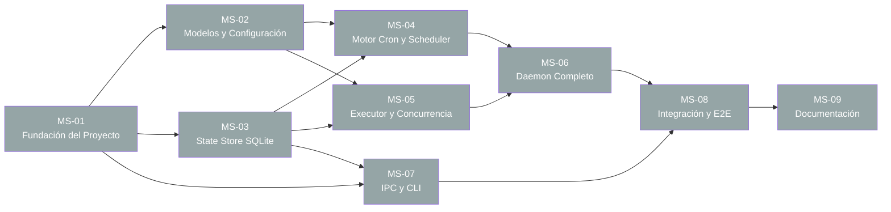

# wcrond — Plan Maestro de Implementación

> **Versión:** 1.0.0  
> **Fecha:** 2026-08-07  
> **Proyecto:** wcrond (Windows Cron Daemon)  
> **Estado:** 🟢 Completado

---

## 1. Mapa de Ejecución

El proyecto se divide en **8 milestones** diseñados para maximizar la ejecución en paralelo.

### 1.1 Grafo de Dependencias



### 1.2 Tabla de Dependencias

| Milestone | Archivo | Depende de | Paralelizable con |
|-----------|---------|------------|--------------------|
| MS-01 | `milestone-fundacion.md` | Ninguno | — |
| MS-02 | `milestone-modelos-config.md` | MS-01 | MS-03, MS-07 |
| MS-03 | `milestone-state-store.md` | MS-01 | MS-02, MS-07 |
| MS-04 | `milestone-cron-scheduler.md` | MS-02, MS-03 | MS-05 |
| MS-05 | `milestone-executor-concurrencia.md` | MS-02, MS-03 | MS-04 |
| MS-06 | `milestone-daemon.md` | MS-04, MS-05 | — |
| MS-07 | `milestone-ipc-cli.md` | MS-01, MS-03 | MS-02, MS-04, MS-05 |
| MS-08 | `milestone-integracion-e2e.md` | MS-06, MS-07 | — |
| MS-09 | `milestone-documentacion.md` | MS-08 | — |

### 1.3 Fases de Ejecución Paralela

| Fase | Milestones en Paralelo | Descripción |
|------|------------------------|-------------|
| **Fase 0** | MS-01 | Fundación: estructura del proyecto, pyproject.toml, dependencias |
| **Fase 1** | MS-02, MS-03, MS-07 | Modelos de datos + State Store + IPC/CLI (todos dependen solo de MS-01) |
| **Fase 2** | MS-04, MS-05 | Motor cron + Executor (dependen de MS-02 y MS-03) |
| **Fase 3** | MS-06 | Daemon completo: integra scheduler + executor + watchdog + retry |
| **Fase 4** | MS-08 | Tests de integración y E2E |
| **Fase 5** | MS-09 | Documentación final |

---

## 2. Protocolo de Semáforos

### 2.1 Sistema de Estados

| Icono | Estado | Significado |
|-------|--------|-------------|
| ⚪ | No iniciado | La tarea no ha comenzado |
| 🟡 | En progreso | Trabajo activo en curso |
| 🟢 | Completado | Tarea terminada y verificada |
| 🔴 | Fallido/Bloqueado | Error o dependencia bloqueante |

### 2.2 Instrucciones para Sub-agentes

**Al iniciar trabajo en un milestone:**
1. Actualizar el estado del milestone en este documento (`master-plan.md`) a 🟡.
2. Actualizar el estado general en el archivo `milestone-*.md` correspondiente a 🟡.
3. Actualizar cada tarea individual a 🟡 cuando se comience a trabajar en ella.

**Al completar una tarea individual:**
1. Actualizar el estado de la tarea a 🟢 en el archivo `milestone-*.md`.
2. Incluir descripción del resultado en el campo "Razón/Descripción".

**Al completar un milestone:**
1. Verificar que TODAS las tareas estén en 🟢.
2. Ejecutar todos los tests definidos en el milestone.
3. Actualizar el estado del milestone en `master-plan.md` a 🟢.
4. Actualizar el estado general del archivo `milestone-*.md` a 🟢.

**Al encontrar un bloqueo:**
1. Actualizar el estado a 🔴 tanto en `master-plan.md` como en el `milestone-*.md`.
2. Documentar la razón del bloqueo en el campo "Razón/Descripción".
3. Notificar al orquestador con detalles del bloqueo.

---

## 3. Panel de Estado Global

| #     | Milestone               | Estado | Progreso | Última Actualización | Razón/Descripción     |     |
| ----- | ----------------------- | ------ | -------- | -------------------- | --------------------- | --- |
| MS-01 | Fundación del Proyecto  | 🟢     | 4/4      | 2026-08-07           | Completado con éxito  |     |
| MS-02 | Modelos y Configuración | 🟢     | 5/5      | 2026-08-07           | Completado con éxito  |     |
| MS-03 | State Store (SQLite)    | 🟢     | 5/5      | 2026-08-07           | Completado con éxito  |     |
| MS-04 | Motor Cron y Scheduler  | 🟢     | 5/5      | 2026-08-07           | Completado con éxito  |     |
| MS-05 | Executor y Concurrencia | 🟢     | 6/6      | 2026-08-07           | Completado con éxito  |     |
| MS-06 | Daemon Completo         | 🟢     | 5/5      | 2026-08-07           | Completado con éxito  |     |
| MS-07 | IPC Server y CLI        | 🟢     | 6/6      | 2026-08-07           | Completado con éxito  |     |
| MS-08 | Integración y E2E       | 🟢     | 5/5      | 2026-08-07           | Completado con éxito  |     |
| MS-09 | Documentación           | 🟢      | 5/5      | 2026-08-07           | Completado con éxito  |     |

---

## 4. Hito de Documentación (MS-09)

El milestone MS-09 es un hito **final obligatorio e independiente** que se ejecuta tras la validación completa del sistema. Su alcance incluye:

1. **README.md completo**: Instalación, quickstart, configuración, uso del CLI.
2. **Arquitectura As-Built**: Diagramas actualizados que reflejen la implementación final.
3. **Manual de Usuario**: Guía paso a paso para usuarios finales.
4. **Referencia del CLI**: Documentación de todos los comandos de `wcrond-ctl`.
5. **Guía de Desarrollo**: Cómo contribuir, ejecutar tests, estructura del código.

Ver detalle completo en `milestone-documentacion.md`.

---

## 5. Orquestación de Sub-agentes

### 5.1 Estrategia General

Cada milestone se asigna a un sub-agente independiente. Los sub-agentes se lanzan en fases según las dependencias. El orquestador:

1. Verifica el Panel de Estado Global.
2. Identifica milestones con todas las dependencias en 🟢.
3. Lanza sub-agentes para esos milestones.
4. Espera notificaciones de finalización.
5. Repite el ciclo.

### 5.2 Templates de Prompts para Sub-agentes

#### Template: Fase 0 — Fundación

```
Actúa como un desarrollador Python senior. Tu tarea es implementar el Milestone MS-01 (Fundación del Proyecto) para el proyecto wcrond.

**Instrucciones:**
1. Lee el archivo `c:\Users\as116758\dev\wcron\planing\milestone-fundacion.md` para entender las tareas.
2. Lee el PRD en `c:\Users\as116758\dev\wcron\planing\wcrond_prd.md` como referencia.
3. Implementa TODAS las tareas listadas en el milestone.
4. Ejecuta los tests definidos en la sección de Unit Tests.
5. Actualiza los semáforos en el archivo milestone según el Protocolo de Semáforos.
6. Reporta el resultado final.

**Directorio de trabajo:** `c:\Users\as116758\dev\wcron`
**Regla crítica:** NO modifiques código fuera del alcance de este milestone.
```

#### Template: Fase 1 — Milestones Paralelos (MS-02, MS-03, MS-07)

```
Actúa como un desarrollador Python senior. Tu tarea es implementar el Milestone MS-{XX} ({NOMBRE}) para el proyecto wcrond.

**Instrucciones:**
1. Lee el archivo `c:\Users\as116758\dev\wcron\planing\milestone-{ARCHIVO}.md` para entender las tareas.
2. Lee el PRD en `c:\Users\as116758\dev\wcron\planing\wcrond_prd.md` como referencia.
3. Verifica que las dependencias (MS-01) estén completadas revisando `c:\Users\as116758\dev\wcron\planing\master-plan.md`.
4. Implementa TODAS las tareas listadas en el milestone.
5. Ejecuta los tests definidos.
6. Actualiza los semáforos en el archivo milestone según el Protocolo.
7. Actualiza tu estado en `master-plan.md` (Panel de Estado Global).
8. Reporta el resultado final.

**Directorio de trabajo:** `c:\Users\as116758\dev\wcron`
**Regla crítica:** NO modifiques código fuera del alcance de este milestone.
```

#### Template: Fases 2-5 — Milestones con Dependencias

```
Actúa como un desarrollador Python senior. Tu tarea es implementar el Milestone MS-{XX} ({NOMBRE}) para el proyecto wcrond.

**Instrucciones:**
1. Lee el archivo `c:\Users\as116758\dev\wcron\planing\milestone-{ARCHIVO}.md` para entender las tareas.
2. Lee el PRD en `c:\Users\as116758\dev\wcron\planing\wcrond_prd.md` como referencia.
3. Verifica que TODAS las dependencias ({DEPENDENCIAS}) estén en 🟢 revisando `c:\Users\as116758\dev\wcron\planing\master-plan.md`.
   - Si alguna dependencia NO está en 🟢, DETENTE y reporta el bloqueo.
4. Revisa el código existente generado por milestones previos para asegurar compatibilidad.
5. Implementa TODAS las tareas listadas en el milestone.
6. Ejecuta los tests definidos (unit + integración según aplique).
7. Actualiza los semáforos en el archivo milestone.
8. Actualiza tu estado en `master-plan.md`.
9. Reporta el resultado final.

**Directorio de trabajo:** `c:\Users\as116758\dev\wcron`
**Regla crítica:** NO modifiques código fuera del alcance de este milestone. Si necesitas cambios en módulos de otros milestones, documenta el conflicto y reporta.
```

### 5.3 Ejemplo de Lanzamiento con invoke_subagent

```python
# Fase 0: Lanzar MS-01
invoke_subagent(
    TypeName="self",
    Role="MS-01 Fundación",
    Prompt="<template Fase 0 con valores reemplazados>"
)

# Fase 1: Lanzar MS-02, MS-03 y MS-07 en paralelo (después de MS-01 completado)
invoke_subagent(
    Subagents=[
        {TypeName: "self", Role: "MS-02 Modelos", Prompt: "<template>"},
        {TypeName: "self", Role: "MS-03 StateStore", Prompt: "<template>"},
        {TypeName: "self", Role: "MS-07 IPC-CLI", Prompt: "<template>"}
    ]
)

# Fase 2: Lanzar MS-04 y MS-05 en paralelo (después de MS-02 y MS-03)
invoke_subagent(
    Subagents=[
        {TypeName: "self", Role: "MS-04 Scheduler", Prompt: "<template>"},
        {TypeName: "self", Role: "MS-05 Executor", Prompt: "<template>"}
    ]
)

# Fase 3-5: Secuencial
# MS-06 después de MS-04 + MS-05
# MS-08 después de MS-06 + MS-07
# MS-09 después de MS-08
```

---

## 6. Criterios de Aceptación Global

- [ ] Todos los milestones en 🟢
- [ ] Cobertura de tests ≥ 80%
- [ ] `wcrond start` + `wcrond-ctl status` funcional end-to-end
- [ ] Todos los comandos CLI operativos
- [ ] Memoria en idle < 30 MB
- [ ] CPU en idle < 1%
- [ ] Documentación completa generada
- [ ] Smoke test en instalación limpia exitoso
